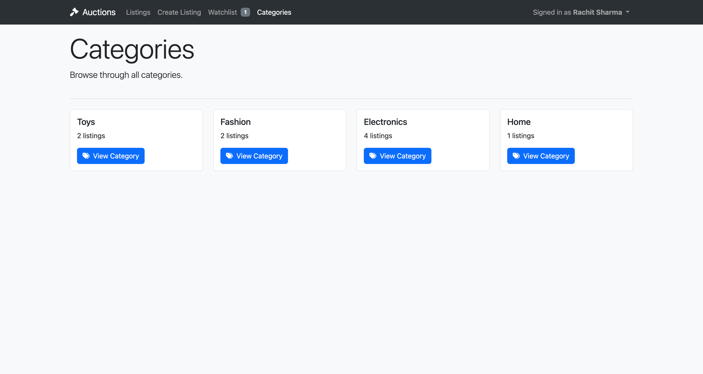

# CSCI-S-33a-project-2

## Project 2: Commerce

### Overview

Design an eBay-like e-commerce auction site that will allow users to post auction listings, place bids on listings, comment on those listings, and add listings to a “watchlist.”

### How to run

#### Prerequisites:

1. To run this project, you will need to clone or download this repository.

2. Install the required packages in the `requirements.txt` file:
  ```bash
  pip install -r requirements.txt
  ```
3. Do the migrations for the database:
  ```bash
  python manage.py makemigrations
  python manage.py migrate
  ```
4. Load the dump json file into the database:
  ```bash
  python manage.py loaddata seed/dump.json
  ```

#### Run server:

To start the server, run the following command:

```bash
python manage.py runserver
```

Once the server is running, visit http://localhost:8000/ in your web browser to view the site.

### Features

- **Create a listing**: Users can create a listing by providing a title, description, starting bid, and (optionally) a URL for an image and/or a category (e.g. Fashion, Toys, Electronics, Home, etc.).

- **Active Listings Page**: The default route of the web application lets users view all of the currently active auction listings. For each active listing, this page displays (at minimum) the title, description, current price, and photo (if one exists for the listing).

- **Listing Page**: Clicking on a listing takes users to a page specific to that listing. On that page, users can view all details about the listing, including the current price for the listing.

- **Watchlist**: Users can visit a Watchlist page, which displays all of the listings that a user has added to their watchlist. Clicking on any of those listings takes the user to that listing’s page.

- **Categories**: Users can visit a page that displays a list of all listing categories. Clicking on the name of any category takes the user to a page that displays all of the active listings in that category.

- **Django Admin Interface**: Via the Django admin interface, a site administrator can view, add, edit, and delete any listings, comments, and bids made on the site.

- **Bidding**: Users can bid on active listings. A user can place a bid on a listing if they are logged in to the site. If the bid is higher than any other bids that have been placed on the listing, the bid is accepted. If not, the user is presented with an error.

- **Close Auction**: If the user who created the listing is logged in, they have the ability to “close” the auction from the listing page, which makes the highest bidder the winner of the auction and makes the listing no longer active.

- **Commenting**: Users who are signed in can add comments to the listing page. The listing page displays all comments that have been made on the listing.

### Screenshots





